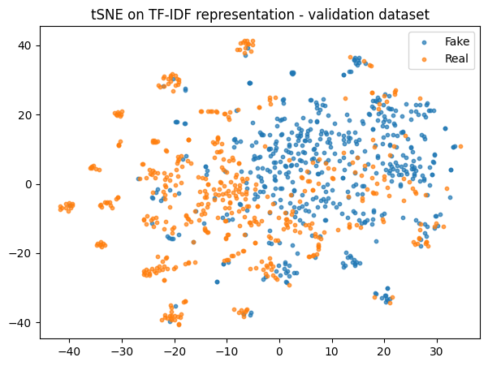
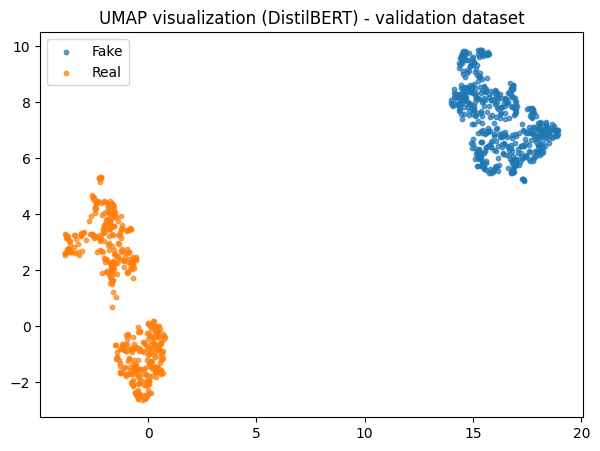
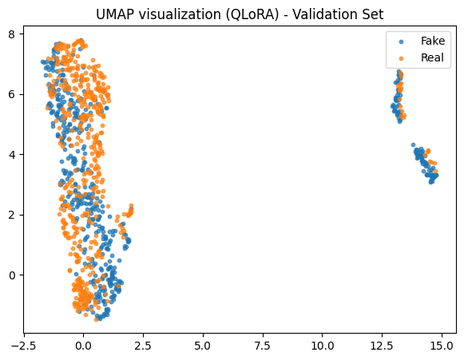

# 📰 Fake News Detection: From TF-IDF to LLMs 

## 📌 Project Overview
This project performs a comparative analysis of different NLP architectures for the task of **Fake News Detection**. The goal is to evaluate how classical methods compare against modern deep learning approaches (Encoder-only and Decoder-only models) in a binary classification task.

The project is divided into three distinct stages, exploring the evolution of NLP techniques:
1.  **Baseline:** Classical Machine Learning (TF-IDF + Logistic Regression).
2.  **Encoder-Only:** BERT-based architecture (DistilBERT).
3.  **Decoder-Only (LLM):** Generative Large Language Model (Qwen/Mistral) using **QLoRA** and **Few-Shot Learning**.

## 📂 Dataset
* **Source:** [HuggingFace: ErfanMoosaviMonazzah/fake-news-detection-dataset-English](https://huggingface.co/datasets/ErfanMoosaviMonazzah/fake-news-detection-dataset-English)
* **Size:** ~44k balanced samples.
* **Preprocessing:** Concatenation of `title` and `text` to capture sensationalist headlines often found in fake news.

---

## 🚀 Approaches & Methodology

### 1. Classical Approach (Baseline)
* **Technique:** TF-IDF (Term Frequency-Inverse Document Frequency) vectorization.
* **Model:** Logistic Regression.
* **Goal:** Establish a strong baseline based on keyword frequency analysis.

#### Hyperparameter Tuning (Grid Search)
To find the optimal configuration for the TF-IDF vectorizer, a Grid Search was performed across the following parameter space:
* `max_features`: `[10000, 30000, 50000]`
* `ngram_range`: `[(1,1), (1,2)]` (Unigrams vs Bigrams)
* `min_df`: `[2, 5, 10]`
* `max_df`: `[0.8, 0.9, 0.95]`

#### Top 10 Configurations
The table below shows the top 10 results sorted by **Accuracy**. The best performance (**98.63%**) was achieved using bigrams `(1, 2)`, indicating that context between adjacent words is crucial for detection.

| Rank | max_features | ngram_range | min_df | max_df | Accuracy | Precision | Recall | F1-Score |
| :--- | :--- | :--- | :--- | :--- | :--- | :--- | :--- | :--- |
| **1** | **10000** | **(1, 2)** | **2** | **0.80** | **0.9863** | **0.9816** | **0.9904** | **0.9860** |
| 2 | 10000 | (1, 1) | 2 | 0.90 | 0.9837 | 0.9766 | 0.9900 | 0.9833 |
| 3 | 10000 | (1, 1) | 10 | 0.90 | 0.9835 | 0.9766 | 0.9897 | 0.9831 |
| 4 | 10000 | (1, 1) | 2 | 0.95 | 0.9833 | 0.9776 | 0.9883 | 0.9829 |
| 5 | 10000 | (1, 1) | 5 | 0.90 | 0.9833 | 0.9763 | 0.9897 | 0.9829 |
| 6 | 10000 | (1, 1) | 5 | 0.95 | 0.9833 | 0.9776 | 0.9883 | 0.9829 |
| 7 | 10000 | (1, 1) | 10 | 0.95 | 0.9833 | 0.9776 | 0.9883 | 0.9829 |
| 8 | 10000 | (1, 1) | 2 | 0.80 | 0.9830 | 0.9763 | 0.9890 | 0.9826 |
| 9 | 10000 | (1, 1) | 5 | 0.80 | 0.9830 | 0.9763 | 0.9890 | 0.9826 |
| 10 | 10000 | (1, 1) | 10 | 0.80 | 0.9828 | 0.9763 | 0.9887 | 0.9824 |

---

### 2. Encoder-Only Approach (DistilBERT)
* **Architecture:** Transformer Encoder (Bidirectional).
* **Model:** `distilbert-base-uncased`.
* **Method:** Full Fine-Tuning (Transfer Learning).
* **Performance:** DistilBERT effectively captures semantic context and bidirectional dependencies, often matching or surpassing the baseline with high efficiency.

### 3. Decoder-Only Approach (Generative LLM)
* **Architecture:** Autoregressive Transformer (Decoder).
* **Model:** `Qwen2.5-1.5B-Instruct`.
* **Techniques:**
    * **Few-Shot Prompting:** Evaluating in-context learning capabilities (0-shot vs 3-shot).
    * **QLoRA:** Efficient fine-tuning using 4-bit quantization and Low-Rank Adapters.
    * **Instruction Tuning:** Data formatted as chat interactions (`User` -> `Assistant`).

---

## 📊 Visualization (Embeddings)
To interpret how models distinguish between Real and Fake news, we extracted the last-layer embeddings and visualized them using **UMAP**.
* **Observation:** Distinct clusters for "Real" and "Fake" classes indicate that the models successfully learned semantic features distinguishing truth from misinformation.

Validation Set UMAP visualization (TF-IDF features):

Validation Set UMAP visualization (DistilBERT embeddings):

Validation Set UMAP visualization (Qwen LLM embeddings):

## 🗝️ Key Findings
1. **Strong Baseline:** Classical **TF-IDF** performed exceptionally well, suggesting that fake news in this dataset is strongly characterized by specific keywords (e.g., clickbait vocabulary).
2. **Encoder Efficiency:** **DistilBERT** offered an excellent balance between performance and speed, serving as a reliable production-ready solution.
3. **LLM Complexity:** While **LLMs** (Decoder-only) offer general knowledge, for this specific binary classification task, they required significant resources (VRAM) without drastically outperforming the simpler, fully fine-tuned Encoder models.

## 🛠️ Technologies Used
* **Python 3.10+**
* **PyTorch** & **Hugging Face Transformers**
* **PEFT** (LoRA) & **BitsAndBytes** (Quantization)
* **Scikit-learn**
* **UMAP-learn** & **Matplotlib**
